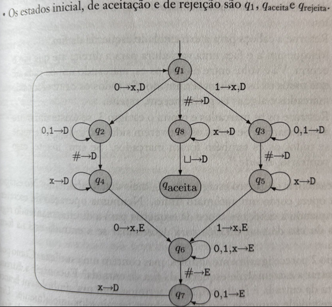

# Questão 5: Saídas Máquina de Turing

## Dados Aluno:

**Marcos Vinicius Reballo**
**nº USP: 7576746**
**Disciplina: Matemática discreta**

---

## Enunciado Problema

Mostre qual a sequência de configurações para a máquina de Turing da figura abaixo quando iniciada com as seguintes entradas:

a) 10#11
b) 10#10

## Imagem do Grafo de Processamento

---

## Resolução

### Introdução

Vamos demonstrar o comportamento operacional de uma máquina de turing de estados finitos, quando submetida a duas diferentes sequências de entrada, especificamente:

1. Cadeia de entrada: `10#11`
2. Cadeia de entrada: `10#10`

### Desenvolvimento da Análise

Vamos acompanhar o processamento de cada sequência, vendo respectivamente os estados, configuração geral da sequência e a posição do leitor, a cada estado.

### Processamento da Primeira Sequência: `10#11`

O processamento desta entrada segue uma trajetória específica através dos estados abaixo:

| Estado de Processamento | Configuração da Fita | Posição do Cursor |
|-------------------------|----------------------|-------------------|
| q1 | [1] 0 # 1 1 | 1 |
| q3 | x [0] # 1 1 | 0 |
| q3 | x 0 [#] 1 1 | # |
| q5 | x 0 # [1] 1 | 1 |
| q6 | x 0 [#] x 1 | # |
| q7 | x [0] # x 1 | 0 |
| q7 | [x] 0 # x 1 | x |
| q1 | x [0] # x 1 | 0 |
| q2 | x x [#] x 1 | # |
| q4 | x x # [x] 1 | x |
| q4 | x x # x [1] | 1 |

**Resultado da Computação:**
O processamento é **interrompido** no estado q4, pois não existe uma transição válida para o símbolo '1' neste estado. Consequentemente, a cadeia de entrada é **rejeitada** pela máquina.

**Estado Final:** q4  
**Configuração Final da Fita:** x x # x 1  
**Posição Final do Cursor:** sobre o símbolo '1'

---

### Processamento da Segunda Sequência: `10#10`

Esta entrada apresenta um comportamento diferente durante o processamento:

| Estado de Processamento | Configuração da Fita | Posição do Cursor |
|-------------------------|----------------------|-------------------|
| q1 | [1] 0 # 1 0 | 1 |
| q3 | x [0] # 1 0 | 0 |
| q3 | x 0 [#] 1 0 | # |
| q5 | x 0 # [1] 0 | 1 |
| q6 | x 0 [#] x 0 | # |
| q7 | x [0] # x 0 | 0 |
| q7 | [x] 0 # x 0 | x |
| q1 | x [0] # x 0 | 0 |
| q2 | x x [#] x 0 | # |
| q4 | x x # [x] 0 | x |
| q4 | x x # x [0] | 0 |
| q6 | x x # [x] x | x |
| q6 | x x [#] x x | # |
| q7 | x [x] # x x | x |
| q1 | x x [#] x x | # |
| q8 | x x # [x] x | x |
| q8 | x x # x [x] | x |
| q8 | x x # x x [] | (posição vazia) |

**Resultado da Computação:**
O processamento é **completado com sucesso** quando o autômato alcança o estado q8 e encontra um símbolo vazio na fita. Isso resulta em uma transição para o estado de aceitação (qAceita). Portanto, a cadeia de entrada é **aceita** pela máquina de Turing.

**Estado Final:** qAceita  
**Configuração Final da Fita:** x x # x x  
**Posição Final do Cursor:** símbolo vazio (_)

---

## Conclusões

A máquina em questão parece implementar um algoritmo de reconhecimento que:

1. **Rejeita** cadeias onde os segmentos antes e depois do separador '#' possuem composições diferentes entre si;
2. **Aceita** cadeias onde ambos os segmentos são idênticos em conteúdo;

Este comportamento sugere que o autômato conseguiria verificar a igualdade entre duas sequências binárias separadas por um delimitador #, por exemplo.

---