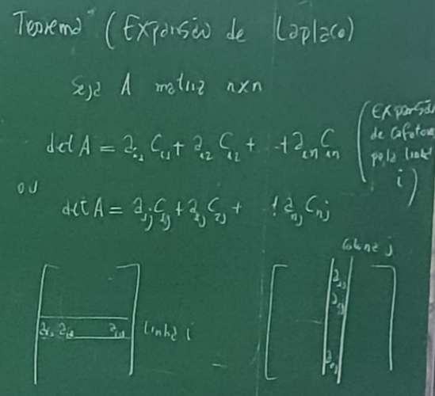

https://youtu.be/-JcQJFNVjaA?si=19zMGne3dJlhJPeo link de aulas de Augelin com professor do ime usp

Boldrini Algebra Linear

## Informações

sites.icmc.usp.br/andreduarte

### Avaliações:

P1 - 06/05
P2 - 27/06

NF = (P1+P2)/2

Listas/Monitor

Sub: A confirmar

## Aula "1"

### Vetores

É oriundo da palavra vetere, que significa andar. A partir de William Hamilton, a partir do seu trabalho principal, que são os números quaternios.

> Pesquisar sobre números quatérnios e william Hamilton e vetores

>Exemplo construtivo de vetor, definição de direção, comprimento e sentido

AB e CD são **equipolentes** se tem mesmo comprimento, direção e sentido.

Vamos tentar entender o que significaria sentido vetorialmente, visto que para ter mesma direção, basta que os vetores sejam paralelos, ou tem o mesmo coeficiente angular.

Se ligarmos os pontos iniciais e finais de cada vetor, e não houver intersecção entre os segmentos(), eles terão o mesmo sentido, enquanto caso eles se intersectem, os vetores terão sentidos opostos.

>Inserir aqui exemplo em imagem de ambos os casos com a ligação dos segmentos

Assim, podemos definir que dado AB, o vetor $\overrightarrow{AB}$ é o conjunto de todos os segmentos orientados equipolente a $\overline{AB}$.

### Vetores em Coordenadas

> Agora temos um exemplo com as coordenadas do gráfico, analiticamente.

$\overrightarrow{AB} = [x_1-x_0, y_1-y_0]$ em coordenadas.

> Enquadrar a definição vetorial acima.

#### Exemplo

$A = (7,10)$ e $B = (1,3)$, teremos que:

$\overrightarrow{AB} = [1-7, 3-10] = [-6, -7]$

> Desenhar o vetor resultante aqui
>

Obs 1: Às vezes, denotamos $[x_0, y_0]$ por $\begin{bmatrix}
x_0 \\
y_0 \\
\end{bmatrix}
$

Obs 2: $\overrightarrow{AB} = \overrightarrow{CD} \leftrightarrow $ $\overline{AB}$ e $\overline{CD}$ são equipolentes.

Obs 3: $\vec{0} = [0,0]$ é o vetor nulo

$P_0 = (x_0, y_0)$, logo \[\overrightarrow{OP} = [x_0 -0, y_0-0]=[x_0, y_0]\]

Assim, dados:

\[
\vec{u} = \overrightarrow{AB} \\
\vec{v} = \overrightarrow{CD}
\]

eles tem mesmo comprimento se $\overline{AB}$ e $\overline{CD}$ tem o mesmo comprimento.

Eles terão a mesma direção/sentido se $\overline{AB}$ e $\overline{CD}$ tem a mesma direção/sentido.

obs: $[x_0, y_0],[x_1, y_1]$ tem mesma direção se $x_0=tx_1$ e $y_0=ty_1$, para algum $t$.

### Soma de Ponto e Vetor

> Imagem de soma de ponto e vetor
>

$P=(x_0, y_0), \vec{u} = [a,b]$, com $Q = P + \vec{u} = (x_0+a,y_0+b)$

#### Exemplo

\[A=(6,12)\\
B=(7,10)\\
P=(5,2)\]

Solução: Calcularemos o vetor $\vec{u}$ e depois somaremos com o valor do ponto $P$.

\[\vec{u} = [7-6,10-12]=[1,-2]\\
P+\vec{u}=(5+1, 2-2)=(6,0)\]

Perceba que a soma de ponto com vetor *sempre resultará em um ponto.*

>Inserir aqui uma imagem com a representação de dita soma.

### Operações com Vetores

#### Soma

\[
\vec{u}=[u_1,u_2]\\
\vec{v}=[v_1,v_2]\\
\\
\vec{v}+\vec{u}=[v_1+u_1,v_2+u_2]
\]

**Exemplo:**
Dados:
\[
\vec{u} = [-1,2]\\
\vec{v} = [4,5] \\
\]
Calculemos:
\[
\begin{align*}
\vec{u}+\vec{v} &= [-1,2]+[4,5] \\
&=[-1+4,2+5]\\
&=[3,7]
\end{align*}
\]

>Inserir regra do paralelogramo aqui

#### Multiplicação por escalar

Seja $\lambda$ um número real e $\vec{v} = [v_1, v_2]$. Logo, $\lambda\vec{v} = [\lambda v_1,\lambda v_2]$.

**Exemplo:**

Dados \[
\vec{v} = [2,3]    
\]

Teremos:

\[
2\vec{v} = [4,6]\\
\frac{1}{2}\vec{v} = [1,\frac{3}{2}]
\]

> Listar aqui as propriedades de lambda
>
## Aula "2"

#### Subtração de Vetores

$\vec{u}$ e $\vec{v}$ vetores, sabemos que:

\[
\vec{u} - \vec{v} = \vec{u} + \vec{-v}
\]

Algebricamente, $\vec{u} - \vec{v} = [u_1-v_1,u_2-v_2]$

### Vetores no Espaço

\[
\vec{v}-\overrightarrow{OP} = [x_0,y_0,z_0]
\]

#### Soma

\[
\vec{u} = [u_1,u_2,u_3]\\
\vec{v} = [v_1,v_2,v_3]\\
\vec{u}+\vec{v} = [u_1+v_1, u_2+v_2, u_3+v_3]
\]

#### Multiplicação por Escalar

Seja $\lambda$ um número e $\vec{v} = [v_1,v_2,v_3]$.

\[
\lambda \vec{v} = [\lambda v_1, \lambda v_2, \lambda v_3]
\]

### Vetores em $\mathbb{R^n}$

$\mathbb{R^n}$ denota a sequência ordenada de n números (vetores em n coordenadas):

\[
\vec{u} = [u_1, u_2, u_3, ... , u_n]
\]

#### Soma

\[
[u_1, u_2, u_3,..., u_n] + [v_1,v_2,v_3,..., v_n] = [u_1+v_1, u_2+v_2, ...., u_n + v_n]
\]

#### Multiplicação por Escalar

\[
\lambda[u_1, u_2, ..., u_n] = [\lambda u_1, \lambda u_2,..., \lambda u_n]
\]

#### Operações Algébricas

1 - $\vec{u}+\vec{v}=\vec{v}+\vec{u}$ (Comutativa);

2 - $(\vec{u}+\vec{v}) + \vec{w} = \vec{u}+(\vec{v} + \vec{w})$ (Associativa);

3 - $\vec{u} + \vec{0} = \vec{u}$

4 - $\vec{u} + (-\vec{u}) = \vec{0} = (-\vec{u}) + \vec{u}$

5 - $(c+d)\vec{u} = c\vec{u} + d\vec{u}$ (Distributiva)

6 - $c(\vec{u}+\vec{v} = c\vec{u}+c\vec{v})$

7 - $(cd)\vec{u} = c(d\vec{u})$

8 - $1\cdot\vec{u}=\vec{u}$

## Aula 3

### Vetores Binários

/+ | 0 1   .| 0 1
0 | 0 1   0| 0 0
1 | 1 0   1| 0 1

Exemplo: 1 + 0 + 1 + 1 = 1 + 0 + 0 = 1 + 0 = 1

1 + 1 + 1 + 1 = 0

$\mathbb{Z_+^*} = {0,1}$

Vetores com coordenadas {0,1} e temos a coordenada $\mathbb{Z_+^*}$ vetores binários.

Exemplo: \[
    \vec{v} = [0,1,1,0,1]\\
    \vec{u} = [1,1,0,1,1]\\
    \vec{v}+\vec{u} = [1+0, 1+1, 0+1, 1+0, 1+1]\\
    =[1,0,1,1,0]
    \]

Quantos vetores binários existem então?

\[
[0,0],[0,1],[1,0],[1,1]
\]

Em $\mathbb{Z_2^n}$ temos $2^n$ vetores binários.

#### Inteiros módulo 3

\[
\mathbb{Z_3} = {0,1,2}
\]

$$\begin{array}{|c|c|c|c|}
\hline
/+ & 0 & 1 & 2 \\ \hline
0 & 0 & 1 & 2 \\ \hline
1 & 1 & 2 & 0 \\ \hline
2 & 2 & 0 & 1 \\ \hline
\end{array}
$$

$$\begin{array}{|c|c|c|c|}
\hline
/\cdot & 0 & 1 & 2 \\ \hline
0 & 0 & 0 & 0 \\ \hline
1 & 0 & 1 & 2 \\ \hline
2 & 0 & 2 & 1 \\ \hline
\end{array}
$$

com $[0,1,2]$ é vetor ternário

Exemplo:

\[
\vec{u} = [0,1,2]\\
\vec{v} = [1,1,0]\\
\vec{u}+\vec{v} = [1,2,2]
\]

#### Produto Escalar

Seja \[\vec{u} = \begin{bmatrix}
u_1 \\
u_2 \\
... \\
u_n
\end{bmatrix}, \vec{v} = \begin{bmatrix}
v_1 \\
v_2 \\
... \\
v_n
\end{bmatrix}
\] em $\mathbb{R}$

O produto escalar desses vetores é definido como:

\[\vec{u}\cdot\vec{v} = u_1v_1+u_2v_2+...+u_nv_n\]

Obs: Os vetores tem o mesmo número de coordenadas e **o produto escalar é sempre um número real.**

#### Propriedades de Produto Escalar

Sejam $\vec{u}, \vec{v}$ e $\vec{w}, $vetores e $\lambda$ um escalar

\[
\vec{u}\cdot\vec{v} = \vec{v}\cdot\vec{u}\\
\\
(\vec{u}+\vec{v})\cdot\vec{w} =\vec{u}\cdot\vec{w} +\vec{v}\cdot\vec{w}\\
(\lambda\vec{u})\cdot\vec{v} = \lambda (\vec{u}\cdot\vec{v})\\
\vec{u}\cdot\vec{u} \geq 0 ,
 \vec{u}\cdot\vec{u} = 0 \iff \vec{u} = \vec{0}
\]

> Tente provar a propriedade 2 e 4.
>

### Norma de um Vetor

$$\|v\| = \sqrt{x^2 + y^2} = \sqrt{\vec{v}\cdot\vec{v}}$$, sendo x e y as coordenadas do vetor, considerando a distância do ponto P e a origem.

A **norma euclideana** de um vetor $\vec{v}$ no $\mathbb{R^n}$ é \[
\|v\|_2 = \sqrt{\vec{v}\cdot\vec{v}}  = \sqrt{v_1^2 +v_2^2 + ... + v_n^2}
\]

#### Propriedades

\[
\|\vec{u}\|_2 = \vec{0} \iff \vec{u} = \vec{0}\\
\|\lambda\vec{u}\| = |\lambda|\|\vec{u\|}
\]

> Verifique ambas as propriedades, lembrar da CE de módulo, onde:
>

\[
|\lambda| =
\begin{cases} 
\lambda & \text{se } \lambda \geq 0, \\ 
-\lambda & \text{se } x < 0
\end{cases}    
\]

### Vetores Unitários

$\vec{v}$ é unitário se $\|\vec{v}\| = 1$. Para encontrar o vetor unitário de um vetor qualquer, basta dividi-lo pela norma ${r}$ do vetor $\vec{v}$, ou seja:

\[
\vec{u} = \dfrac{1}{r}\vec{v}
\]

### Desigualdade de Cauchy-Schwarz

Seja $\vec{u}, \vec{v}$ vetores em $\mathbb{R^n}$:

\[
|\vec{u}\cdot\vec{v}| \leq \|\vec{u}\|\cdot\|\vec{v}\|
\]

### Desigualdade Triangular

Seja $\vec{u}, \vec{v}$ vetores em $\mathbb{R^n}$:

\[
\|\vec{u}+\vec{v}\| \leq \|\vec{u}\|+\|\vec{v}\|
\]

> Prove:

## Aula 4

Prosseguindo, vamos definir, em geral uma norma em $\mathbb{R^n}$ é uma função $\|\cdot\| = \mathbb{R^n} \rightarrow \mathbb{R^n}$ satisfazendo:

\[
(i): \|u\| \geq 0 \text{ e } \|u\| = 0 \iff u = 0\\
(ii):\|\lambda u\| = |\lambda|\cdot \|u\|\\
(iii): \|u+v\| \geq \|u\| + \|v\|
\]

$\|\cdot\|_2 \text{ é somente UMA norma}.$

Exemplo: 

\[u = [u_1, u_2, ..., u_n]\\
    \|u\|_\infty = max\{|u_1|, |u_2|, ...,|u_n|\}\\
    \text{norma } l_\infty\]

\[u = [u_1, u_2, ..., u_n]\\
    \|u\|_1 = |u_1| + |u_2| + ... + |u_n|\\
    =\sum_{i=1}^{n}|u_i|\\
    \text{norma } l_1\]

Com a desigualdade abaixo como verdadeira:

\[
\|u\|_1 \geq \|u\|_2 \geq \|u\|_\infty
\]

Exemplo:

$$p>1, \text{sendo p um número real. }\\
u=[u_1, u_2,...,u_n]\\
 \\
  \\
   \\
    \\
\|u\|_p = (|u_1|^p+|u_2|^p+...+|u_n|^p)^{\frac{1}{p}}\\\text{norma } l_p$$

### Desigualdade de Holder

$u=[u_1, u_2, ..., u_n],\\ v=[v_1, v_2, ..., v_n], \\ p>1,$

\[
|u\cdot v| \leq \|u\|_p\|v\|_q\\
\text{ }\\
\text{com } \dfrac{1}{p} + \dfrac{1}{q} = 1\\
\]

Explicitamente, teremos:

\[|\sum_{i=1}^{n}{u_i \cdot v_i}| \leq (\sum_{i=1}^{n}{|u_i|^p})^\dfrac{1}{p}(\sum_{i=1}^{n}{|v_i|^p})^\dfrac{1}{q} \]

### Desigualdade de Minkowski

\[\|u+v\| \leq \|u\|_p + \|v\|_q\]

#### Prova

$u=[u_1, u_2, ..., u_n],\\ v=[v_1, v_2, ..., v_n]$

Teremos que:

\[
\|u+v\|_p = (|u_1+v_1|^p + |u_2+v_2|^p + ... + |u_n+v_n|^p)^\dfrac{1}{p}\\
\]

Elevando ambos os lados por p, teremos:

\[
\begin{aligned}
    (\|u+v\|_p)^p &= \sum_{i=1}^{n}{|u_i+v_i|^p}\\
    &= \sum_{i=1}^{n}{|u_i+v_i|^{p-1}}\cdot |u_i+v_i|\\
    &\leq \sum_{i=1}^{n}{|u_i+v_i|^{p-1}}\cdot (|u_i|+|v_i|)\\
    &=\sum_{i=1}^{n}{|u_i+v_i|^{p-1}}\cdot (|u_i|) + \sum_{i=1}^{n}{|u_i+v_i|^{p-1}}\cdot (|v_i|)
\end{aligned}
\]

Agora, sejam $w_i = |u_i+v_i|^{p-1}$ e $z_i = |u_i|$

Reescrevendo, teremos que:

\[
|\sum_{i=1}^{n}{w_iz_i}| = |\sum_{i=1}^{n}{z_iw_i}| \\
\leq (\sum_{i=1}^{n}{|z_i|^p})^\frac{1}{p}(\sum_{i=1}^{n}{|w_i|^q})^\frac{1}{q}\\
= \|u\|_p(\sum_{i=1}^{n}{|u_i+v_i|^{q(p-1)}})^\frac{1}{q}\\
= \|u\|_p[(\sum_{i=1}^{n}{|u_i+v_i|^p})^\frac{1}{p}]^\frac{p}{q}\\
= \|u\|_p(\|u+v\|_p)^\frac{p}{q}
\]

Logo:

\[
\begin{aligned}
    &=\sum_{i=1}^{n}{|u_i+v_i|^{p-1}}\cdot (|u_i|) + \sum_{i=1}^{n}{|u_i+v_i|^{p-1}}\cdot (|v_i|)\\
    &\leq \|u\|_p \cdot \|u+v\|_p^\frac{p}{q} + \|v\|_p \cdot \|u+v\|_p^\frac{p}{q}\\
    (\|u+v\|_p)^p &\leq  (\|u\|_p+\|v\|_p)\|u+v\|^\frac{p}{q}\\
    \|u+v\|_p&\leq
\end{aligned}
\]

> finalizar
>
### Distância

em $\mathbb{R^2}$:

>imagem whats pedro

$d=d(P,Q)=\sqrt{(u_1-v_1)^2 +(u_2-v_2)^2}$
**Distância Euclidiana**

Em geral,

>imagem pedro cel:

em geral, $u, v \text{ vetores em } \mathbb{R^n}$:

\[
d(u,v) = \|u-v\|_2
\]

\[
(i): u, v \text{ em } \mathbb{R^n}\\
d_\infty(u,v) = \|u-v\|_\infty
\]
**Distância de Chebyshev**

\[
(i): u, v \text{ em } \mathbb{R^n}\\
d_1(u,v) = \|u-v\|_1
\]
**Distância de Manhattan**

## Aula 4

### Ângulos entre Vetores

$\theta \text{ é o ângulo entre os vetores } \vec{u} \text{ e } \vec{v}, 0 \leq \theta \leq 180°$. Pela geometria plana, teremos:

$\|v\|,\|u-v\|,\|u\|$ são uma trinca triangular. Logo, podemos escrever, pela **lei dos cossenos:**

\[
\|u-v\|^2 = \|u\|^2 + \|v\|^2 - 2\cdot\|u\|\cdot\|v\|\cos\theta\\
\]

Mas, pela definição da norma euclideana, teremos:

\[
\begin{aligned}
\|u-v\|^2 &= (u-v)\cdot(u-v)\\
&=u\cdot u -u\cdot v-v\cdot u+v\cdot v\\
&=u\cdot u +v\cdot v - 2u\cdot v\\
&= \|u\|^2+\|v\|^2-2uv
\end{aligned}
\]

Isolando o cosseno na expressão original e igualando a norma da diferença, teremos que:

\[
\begin{aligned}
\|u\|^2 + \|v\|^2 - 2\cdot\|u\|\cdot\|v\|\cos\theta &= \|u\|^2+\|v\|^2-2uv\\
\cos\theta &= \dfrac{u\cdot v}{\|u\|\cdot\|v\|}
\end{aligned}
\]

LEMBRANDO QUE u E v SÃO NÃO NULOS.

Exemplo:

$$u = [2,1,2]\\ v = [1,1,1]\\
uv = 1, \|u\| = 3, \|v\|=\sqrt{3}$$

Logo, teremos que o cosseno será:

$$\cos\theta = \dfrac{1}{3\sqrt{3}}$$, assim $\theta$ será igual aproximadamente 78,9°.

### Vetores Ortogonais

Sendo ortogonais, o ângulo entre dois vetores será 90°, logo seu cosseno será nulo. Assim, teremos que uma consequência poderá ser observada somente visualizando o produto escalar:

$$u \cdot v = \|u\| \cdot \|v\|\cos\theta = 0\\
u \cdot v = 0$$

#### Definição

$u \text{ e } v \text{ no } \mathbb{R^n} \text{ são ortogonais se } u \cdot v = 0$

Obs: $\vec{0}\cdot\vec{v} = 0 \text{ para todo }\vec{v} \text{ pois } \vec{0} \text{ é ortogonal a qualquer vetor.}$

#### Teorema de Pitágoras no $\mathbb{R^n}$

$$u, v \text{ são ortogonais } \iff \|u+v\|^2 = \|u\|^2+\|v\|^2 $$

> Tente realizar a prova, provando a ida e a volta
>

Uma  das aplicações possíveis seria a área de sinais ortogonais.

> Procurar definição de produto escalar utilizando integração

#### Projeções

Podemos escrever que:

$$proj_u(v) = \dfrac{u\cdot v}{\|u\|^2}\cdot u$$

é a **projeção ortogonal de v em u**

Exemplo: $u=[2,7,10], v=[-1,5,4]$. Determine p, q vetores tais que v = p+q e p//u, e q é ortogonal a u.

gabarito: 

> Encontre
>

## Aula 5 - Geometria e Vetores

Exemplo: 

$\text{Vamos encontrar o ponto médio } M \text{ de dois pontos } A, B.$

\[\vec{AM} = \vec{m} - \vec{a}\\
\vec{MB} = \vec{b} - \vec{m}\\
\quad \\
\vec{m} - \vec{a} = \vec{b} - \vec{m}
\vec{m} = \dfrac{1}{2}(\vec{a}+ \vec{b})
\]

Resolvendo algebricamente, teremos que:

$A=(x_1, y_1), B =(x_2, y_2), \vec{a} = [x_1, y_1], \vec{b} = [x_2, y_2]$

Logo, \(\vec{m} = \left[\dfrac{x_1+x_2}{2}, \dfrac{y_1+y_2}{2}\right]\)

Exemplo 2: Relações Geométricas no paralelogramo ABCD

Seja \(M\) o ponto de intersecção das diagonais de um paralelogramo não retângulo. Vamos verificar que os pontos médios delas coincidem em \(M\).

Vamos supor que \(M\) é ponto médio de \(\overline{AC}\). Logo

\[\overrightarrow{BM} = \overrightarrow{BC} + \overrightarrow{CM} \]

Mas \(\overrightarrow{BC} = \overrightarrow{AD}\) e \(\overrightarrow{CM} = \overrightarrow{MA}\), (são lados paralelos do paralelogramo ), assim:

\[\overrightarrow{BM} = \overrightarrow{BC} + \overrightarrow{CM} = \overrightarrow{AD} + \overrightarrow{MA} = \overrightarrow{MD}\]

### Retas

### Equação Geral da Reta

\[Ax+By+C=0\quad A,B,C \in \mathbb{R}, B \neq 0\]

Vamos adaptá-la para o formato da equação reduzida da reta:

\[By = -Ax-C\\
\quad\\
y = -\dfrac{A}{B}x-\dfrac{C}{B}\]

### Equação reduzida ou NORMAL da reta:

\[y=mx+k\]

Exemplo: \(r: 2x + y = 0, \quad \vec{n} = \begin{bmatrix} 2 \\ 1 \end{bmatrix} , \quad \vec{X} = \begin{bmatrix} x \\ y \end{bmatrix} 
\)

Teremos:

\[\vec{n}\cdot\vec{X} = 2x + y\\
\quad\\
r: \vec{n}\cdot\vec{X} = 0\]

Veja que **\(\vec{n}\) é vetor normal a \(r\)**

A norma euclidiana está principalmente ligada ao esquadro.

### Equação Vetorial

Dado um ponto \(X\), podemos escrever:

\[X = O + \overrightarrow{OX}\\ \quad\\ \overrightarrow{OX} = t\vec{v} \quad\\\iff \\
X = O +t\vec{v}\]

Temos que \(X\) é a equação vetorial de \(r\), \(0 \neq \vec{v}\) é um vetor diretor de \(r\) e \(t\) é o parâmetro.

### Equação Paramétrica

Se desenvolvemos a equação vetorial, chegamos na versão paramétrica.

Seja \(\vec{v} = \begin{bmatrix} -1 \\ 2 \end{bmatrix}\). Podemos escrever que:

\[\begin{aligned}
(x, y) &= (0,0) + t \cdot \begin{bmatrix} -1 \\ 2 \end{bmatrix}\\
&= (0-t, 0+2t)\\
&= (-t,2t), \quad t \in \mathbb{R}
\end{aligned}
\]

**Exemplo:** Seja \(r: 2x+ y = 5, \quad P = (0,5) \implies y = 2x+5, \quad \left(\dfrac{5}{2}, 0\right)\)

\(\vec{n}\cdot\overrightarrow{PX} = 0 \text{ equação normal}\\ \quad\\ \overrightarrow{PX}= X - P = [x, y-5]\)

Vamos verificar!

\[\begin{bmatrix} 2 \\ 1 \end{bmatrix}\cdot \begin{bmatrix} x \\ y-5 \end{bmatrix} = 2x+y-5=0 \implies 2x+y = 5\]

### Definição

A equação da reta \(r\) na forma normal passando pelo ponto \(P\) e com vetor normal \(\vec{n}\) é

\[\vec{n}\cdot\overrightarrow{PX} = 0\]

sendo \(X=(x,y)\) um ponto genérico de \(r\), válido para \(\mathbb{R^2}\)

### Equação Geral da Reta de \(r\)

\[ax+by = c\]

com \(\vec{n} = \begin{bmatrix} a \\ b \end{bmatrix}\) o vetor normal.

### A equação geral vetorial de \(r\)

\[X = P + t\vec{v}, \quad t \in \mathbb{R}\\
X = (x,y,z), \quad P = (x_0, y_0, z_0) \quad \vec{v} = \begin{bmatrix} a \\ b \\ c \end{bmatrix}\]

Teremos que a equação paramétrica será

\[\begin{aligned}
(x,y,z) &= (x_0, y_0, x_0) + t \cdot \begin{bmatrix} a \\ b \\ c \end{bmatrix}\\
&= (x_0 + ta, y_0 + tb, z_0 + tc)\\
\end{aligned}
\]

**Exemplo:** Determine a equação vetorial da reta passando por \(A = (-1, 2, 3)\) e \(B = (0,1,4)\)

Vamos utilizar a *notação de Grassmann*:

\[\begin{aligned}
\vec{v} &= \overrightarrow{AB} = B - A\\
&= [0,1,4] - [-1,2,3]\\
&= [1,-1,1]\\
\end{aligned}
\]

\[r: X = (x,y,z) = (-1,2,3) + t\begin{bmatrix} 1 \\ -1 \\ 1 \end{bmatrix}, \quad t \in \mathbb{R}\]

\[
\left\{
\begin{array}{l}
x = -1 + t \\
y = 2 - t, \quad t \in \mathbb{R}, \quad \text{eq. paramétrica} \\
z = 3 + t\\
\end{array}
\right.
\]

Vamos verificar se \(Q = (7,10,5)\) está em \(r\)?

\[
\left\{
\begin{array}{l}
7 = -1 + t \\
10 = 2 - t  \implies t = 8 = -8, \text{ absurdo!!}\\
5 = 3 + t\\
\end{array}
\right.
\]

Logo \(Q\) não está em \(r\)

### Equação Simétrica

Seja uma reta com vetor diretor \(\vec{v} = \begin{bmatrix} a \\ b \\ c \end{bmatrix}\) e \(a,v,c \neq 0\). Seja \( P=(x,y,z) \) em \(r\).

Vamos isolar o parâmetro \(t\) nas equações paramétricas. Iremos obter:

\[r: \dfrac{x-x_0}{a} = \dfrac{y-y_0}{b} = \dfrac{z-z_0}{c}\]

Teste para ponto \(Q = (7,10,5), (-3,6,9)\)

## Aula 6 - Planos

No plano cartesiano:

\[ r: 2x+by+c = 0 \quad (a,b,c \in \mathbb{R})
    \]

No espaço tridimensional: \( ax+by+cz+d=0 \quad (a,b,c,d \in \mathbb{R})\)

Veja que para \(d=0\) temos a equação \(ax+by+cz=0\).

Vetorialmente, podemos representar a equação do plano como:

\[\vec{n}=\begin{bmatrix} a \\ b \\ c \end{bmatrix}, \quad \overrightarrow{OX} = \begin{bmatrix} x \\ y \\ z \end{bmatrix}, \text{ com O sendo a origem e } X = (x,y,z) 
    \]

\(\vec{n}\) ** é o vetor norma**

### A Origem

Seja \(0 = \vec{n} \cdot \overrightarrow{OX} = ax+by+cz\). Sendo \(0 = (0,0,0)\), teremos \(a \cdot 0 +b \cdot 0 +c \cdot 0 =0\). Logo, 0 satisfaz \(\mathbb{C}\).

### Definição 1

Um plano \(R\) passando por \(P\) e com vetor normal \(\vec{n}\) tem **equação normal**:

\[ \vec{n}\cdot \overrightarrow{PX} = 0\\
\quad \\
\begin{bmatrix} \vec{n} = [a,b,c] \\ P = (x_0, y_0, z_0) \\ X=(x,y, z) \end{bmatrix} \quad \text{ou } [a,b,c] \cdot [x-x_0,y-y_0,z-z_0] = 0
    \]

Desenvolvendo, teremos:

\[\implies a(x-x_0) + b(y-y_0) + c(z-z_0) = 0\\
ax+by+cz+d = 0 \quad \text{sendo } d =- (ax_0+by_0+cz_0)
\]

### Definição Equação Geral do Plano

A equação \(\pi: ax+by+cz+d =0 \) é uma **equação geral do plano**. Voltando para o caso \(d=0\).

> Imagem de vetor n perpendicular ao plano que contém ox e ox'
>

#### Exemplo

\((I) \quad P = (6,0,1), \quad \vec{n} = \begin{bmatrix} 7 \\ 10 \\ 3 \end{bmatrix}\)

A equação normal será:

\[\vec{n} \cdot \overrightarrow{PX}=0\\
\quad \\
\begin{bmatrix} 7 \\ 10 \\ 3 \end{bmatrix} \cdot \begin{bmatrix} x-6 \\ y \\ z-1 \end{bmatrix} = 0
\]

A equação geral será:

\[7(x-6) + 10y + 3(z-1) = 0\\
\implies 7x +10y+3z -45 =0
\]

### Equações Vetoriais Paramétricas

Seja um vetor qualquer \(\overrightarrow{PX}\) tal que:

\[\begin{aligned}
\overrightarrow{PX} &= t\vec{u}+s\vec{v}\\
X &= P + \overrightarrow{PX}\\
&= P + t\vec{u}+s\vec{v}, \quad (t,s \in \mathbb{R})\\
\end{aligned}
\]

#### Definição Equação Paramétrica do Plano

A equação \(X = P + t\vec{u}+s\vec{v}\) é uma equação **vetorial * de plano passando por \(P\) e com vetores diretores \(\vec{u}\) e \(\vec{v}\).

\[X=(x,y,z), P = (x_0,y_0,z_0), \vec{u} = \begin{bmatrix} m \\ n \\ p \end{bmatrix}, \vec{v} = \begin{bmatrix} e \\ f \\ g \end{bmatrix}\]

Teremos que:

\[\begin{aligned}
(x,y,z) &= (x_0,y_0,z_0) + t\cdot \begin{bmatrix} m \\ n \\ p \end{bmatrix} + s \cdot \begin{bmatrix} e \\ f\\ p \end{bmatrix}\\
&=(x_0,y_0,z_0) + \begin{bmatrix} tm \\ tn \\ tp \end{bmatrix} + \begin{bmatrix} se \\ sf\\ sp \end{bmatrix}\\
&= (x_0,y_0,z_0) + t\begin{bmatrix} tm+se \\ tn+sf \\ tp + sg \end{bmatrix}\\
&= (x_0 + tm+se, y_0+ tn+sf, z_0 + tp+sg)\\
\end{aligned}
\]

Se expandirmos como um sistema de equações, podemos escrever como:

\[\left\{
\begin{array}{l}
x = x_0 + tm + se \\
y = y_0 + tn +sf \\
z = z_0 +tp + sg\\
\end{array}
\right.
\]

Ela é a **equação paramétrica do plano** passando por P e com vetores diretores.

#### Exemplo:

\[\left\{
\begin{array}{l}
P = (0,0,0) \\
Q = (7,9,8) \\
R = (10,4,7)\\
\end{array}
\right.
\]

Vamos encontrar a **equação vetorial**, **equação paramétrica** e responder se (1,2,2) está em \(\pi\), sendo ele o plano definido por P, Q, R.

>resolve aew, bixão!
Primeiro definimos os vetores pr e pq, para verificarmos se serão paralelos. Após isso, basta resolver cada uma. A última, o ponto não está no plano \(pi\).

## Aula 7 - Produto Vetorial e Propriedades

### Produto Vetorial

#### Definição 

Seja \(\vec{u} = \begin{bmatrix} u_1 \\ u_2 \\ u_3 \end{bmatrix}, \vec{v} = \begin{bmatrix} v_1 \\ v_2 \\ v_3 \end{bmatrix}\), teremos que o produto vetorial será:

\[
\vec{u} \times \vec{v} = \begin{bmatrix} u_2 \cdot v_3 -u_3v_2 \\ u_3 \cdot v_1  -u_1v_3 \\ u_1 \cdot v_2 -u_2v_1 \end{bmatrix}
\]

Cálculo do produto vetorial(Regra de Sarrus)

\(\vec{u} = \begin{bmatrix} u_1 \\ u_2 \\ u_3 \end{bmatrix}, \vec{v} = \begin{bmatrix} v_1 \\ v_2 \\ v_3 \end{bmatrix}\)

\[\vec{u} \times \vec{v} = \begin{bmatrix} \vec{i} & \vec{j} & \vec{k} \\ u_1 & u_2 & u_3 \\ v_1 & v_2 & v_3 \end{bmatrix} \]

#### Exemplo

\(\vec{u} = \begin{bmatrix} 1 \\ 0 \\ -1 \end{bmatrix}, \vec{v} = \begin{bmatrix} 3 \\ 2 \\ 0 \end{bmatrix}\\
\quad \\
\vec{u} \times \vec{v} = \begin{bmatrix} 0\cdot 0 -(-1)2 \\ (-1)\cdot 3 - 1\cdot 2 \\ 1\cdot 2 - 0 \cdot 3 \end{bmatrix}= \begin{bmatrix} 2 \\ -3 \\ 2 \end{bmatrix}\)

Se fizermos a partir do determinante dos versores \(\vec{i}, \vec{j}, \vec{k}\), teremos:

\[\vec{u} \times \vec{v} = \begin{vmatrix}
\vec{i} & \vec{j} & \vec{k} \\ 1 & 0 & -1 \\ 3 & 2 & 0 
\end{vmatrix} = \begin{bmatrix} 2 \\ -3 \\ 2 \end{bmatrix}\]

Veja que o vetor resultante é o **vetor normal aos dois vetores** \(\vec{u}\) e \(\vec{v}\).

#### Exemplo

Seja \(\pi\) um plano passando por \(P=(-1,0,2)\), com vetores diretores \(\vec{u} = \begin{bmatrix} 1\\0\\-1\end{bmatrix}, \vec{v} = \begin{bmatrix} 3\\2\\0\end{bmatrix}\)

Encontre uma equação geral para \(\pi\).

**Solução:**

\(\vec{n} = \vec{u} \times \vec{v} = \begin{bmatrix} 2 \\ -3 \\ 2 \end{bmatrix}\) é um vetor normal a \(\pi\).

Mas veja que \(\vec{n}\cdot \overrightarrow{PX} = 0\)

\[
\begin{aligned}
\overrightarrow{PX} &= X - P\\
&=[x-(-1); y-0; z-2]\\
&=[x+1, y , z-2]\\
\end{aligned}\\
\quad\\
\text{Substituindo na equação anterior, teremos: }
\quad\\
[2,-3,2] \cdot [x+1,y,z-2] = 0\\
\implies\\
2(x+1) - 3y +2(z-2) = 0\\
\quad \\
\pi: 2x-3y +2z-2 = 0
\]

Em geral, seja \(\pi\) um plano por \(P(x_0, y_0, z_0)\) com vetores diretores \(\vec{u} =[u_1, u_2, u_3]\) e \(\vec{v}=[v_1,v_2, v_3]\) podemos encontrar a equação geral do plano pelo ponto P:

> DEDUZA
>

\[
\begin{vmatrix}x-x_0 & y-y_0 &z -z_0\\ u_1 & u_2 & u_3\\ v_1 &v_2&v_3\end{vmatrix} = 0
\]

#### Exemplo

Encontre a equação geral do plano \(\pi\) passando por \(P=A=(1,1,1), B=(2,1,2), C=(3,1,1)\).

Vamos encontrar os vetores \(\vec{u}=\overrightarrow{AB}\) e \(\vec{v}=\overrightarrow{AC}\)

Sabemos que os vetores anteriores são paralelos \(\iff \vec{u} = \alpha\vec{v}\), para algum escalar \(\alpha\), porém facilmente percebemos que não existe tal \(\alpha\)(calcule!).

Assim, os vetores *não são paralelos*, logo \(\vec{u}\) e \(\vec{v}\) **são vetores diretores de \(\pi\)**.

Aplicando a equação geral do plano:

\[
\begin{vmatrix} 
x-1 & y-1 & x-1\\
1 & 0 & 1\\ 
2&0&0 \\ 
\end{vmatrix}\\
\]

\[
\quad\\
0(x-1) + 2(y-1)+0(z-1)-0(y-1)+0(x-1)+0(z-1) = 2(y-1) = 0\\

\pi: y-1=0
\]

### Propriedades
Sejam u, v, w vetores e c um escalar.

\(
\begin{aligned}\\
\vec{u} \times \vec{v}&=-\vec{v}\times\vec{u}\\
\vec{u} \times \vec{0} &= \vec{0}\\
\vec{u} \times \vec{u} &= \vec{0}\\
(\vec{u} \times c\vec{v}) &= c\vec{u} \times \vec{v}\\
\vec{u} \times (\vec{v}+\vec{w}) &= \vec{u} \times \vec{v} + \vec{u} \times \vec{w}

\end{aligned}
\)

>> checar depois os dois trechos de cima e verificar depois

## Aula 8 - Sistema de Equações Lineares

Vamos definir **Equação Linear** como:

\[
a_1x_1 + a_2x_2 + a_3x_3 + ... +a_nx_n = b
\]

com \(x_1, x_2, ...x_n \)*variáveis* ou incógnitas, \(a_1, a_2, ... a_n\) os *coeficientes da equação* e \(b\) o *termo independente*.

### Exemplo:

\[x_1 -2x_2 + 4x_3 =-10,\\
3x+4y-9z=1\\
\frac{\pi}{2}t + s\sin{\frac{pi}{3}} = 13\]

SÃO EQUAÇÕES LINEARES

\[x^2+y^2+x^2 = 3\\
\quad\\
\sin{\frac{t}{2}} + \sqrt{s} = 11\\
\quad\\
e^{x_1} - 2x_2 + x_3 =0\\
\]

NÃO SÃO EQUAÇÕES LINEARES

---

*Uma solução* de uma equação linear é um vetor \([s_1, s_2, s_3,... s_n]\) com ponto \((s_1,s_2,..., s_n)\) tal que substituindo \(x_1=s_1, x_2 = s_2,... x_n = s_n\) vale \(a_1x_1 + a_2x_2 + a_3x_3 + ... +a_nx_n = b\).

### Exemplo 2:

\[2x-y = 4,\\
\quad\\
[2,0] \text{ é solução, pois } 2\cdot 2 -0 =4
\]

*Um sistema de equações lineares(SEL)* é um conjunto finito de equações lineares nas mesmas variáveis. *Uma solução* de um **SEL** é um vetor \([s_1,...,s_n]\) que é solução simultânea de todas as equações.

### Exemplo 3:

\[\begin{cases}
x-y=2\\
x+y=0
\end{cases}\]

é SEL com 2 equações e 2 incógnitas, com \([1,-1]\) sendo a solução.

O **conjunto solução** de um SEL é um conjunto de todas as soluções de SEL. Veja que podemos somar a primeira equação com a segunda, e ainda assim o sistema resultado ainda manteria o mesmo conjunto solução. Chamamos sistemas de mesmo conjunto solução como **sistemas equivalentes**.

Entretanto, quando tivermos um sistema de equações no qual uma ou mais equações do sistema são **uma combinação linear** das demais equações, teremos o seguinte problema:

### Exemplo 4:

\[
\begin{cases}
x-2y = 1\\
2x-4y = 2\\
\end{cases}
\quad\\
\implies\\
\quad\\
\text{ dividindo a equação 2...}
\quad\\
\implies\\
\quad\\
\begin{cases}
x-2y = 1\\
x-2y = 1\\
\end{cases}
\quad\\
\implies\\
\quad\\
\begin{cases}
x-2y = 1\\
\end{cases}
\]

Logo o sistema terá **infinitas soluções** que poderemos parametrizar como \(x-2y=1\), com\(y=t, t \in \mathbb{R}\), cuja solução terá a forma:

\[S = {(1+2t,t) | t \in \mathbb{R}} \text{ ou } S = {(1+2t,t) | t \in \mathbb{R}}\]

Veja que se ao longo da simplificação de um sistema linear, obtermos alguma igualdade falsa, dizemos que **o sistemas não possui solução.**

Assim, podemos listar que um sistema linear possui:

- única solução (SPD ou sistema possível e determinado);
- infinitas soluções (SPI ou sistema possível e indeterminado);
- Não possui soluções (SI ou sistema impossível);

### Representação de matrizes \(n x m\) com coeficientes reais:

\[
\begin{bmatrix}
a_{11}&a_{12}&a_{13}&...&a_{1m}\\
a_{21}&a_{22}&a_{23}&...&a_{2m}\\
...&...&...&...&...\\
a_{n1}&a_{n2}&a_{n3}&...&a_{nm}
\end{bmatrix}
\]

é uma matriz com \(n\) linhas e \(m\) colunas.

#### Exemplo

Seja o seguinte sistema linear abaixo:

\[
\begin{cases}
x-y+2z = 4\\
4x+3y+z = 7\\
3x+2y-3z=1\\
\end{cases}
\]

Podemos esboçar a *matriz aumentada do sistema* como:

\[
\begin{bmatrix}
1&-1&2&4\\
4&3&1&7\\
3&2&-3&1\\
\end{bmatrix}
\]

Onde a matriz-coluna do lado esquerdo é o *vetor dos termos independentes* e o restante da matriz, a *matriz dos coeficientes do sistema de equações lineares.*

#### Matriz na forma Escalonada

\[
\begin{bmatrix}
1&-1&-1&2\\
0&1&3&5\\
0&0&5&10\\
\end{bmatrix}
\]

Uma matriz está na *forma escalonada por linhas* se:

1. Toda linha nula está nas últimas linhas;
2. Toda linha não nula tem o 1º coeficiente não nulo(*elemento pivô*) em uma coluna à esquerda de todas as colunas dos pivôs das linhas abaixo.

## Aula 9 - Operações Elementares nas Linhas

1. Trocar Linhas;
2. Multiplicar uma linha por um número;
3. Somar uma linha com um múltiplo de outra;

**Notação:** 
- \(L_i = \) linha i;
- \(L_i \iff L_1\) trocar linha i por j;
- \(kL_i\) multiplicar \(L_i\) por \(k\);
- \(L_i+kL_j\) : \(L_i\) somado com \(L_j\) multiplicado por \(k \geq 0\);
### Exemplo:

Resolva \(
\begin{cases}
x+y+z = 2\\
2x-y+5z = 4\\
3x+2y+z=1\\
\end{cases}
\)

\[
\begin{bmatrix}
1&1&-1&2\\
2&-1&5&4\\
3&0&1&1\\
\end{bmatrix} \implies \\
L_2-2L_1\\
L_3-3L_1\\
\begin{bmatrix}
1&1&-1&2\\
0&-3&7&0\\
0&-1&4&-5\\
\end{bmatrix}
\implies \\
-L_3\\
\begin{bmatrix}
1&1&-1&2\\
0&-3&5&0\\
0&1&-4&5\\
\end{bmatrix}
\implies \\
L_2 <-> L_3\\
\begin{bmatrix}
1&1&-1&2\\
0&1&-4&5\\
0&-3&7&0\\
\end{bmatrix}
\implies \\
L_3 + 3L_2\\
\begin{bmatrix}
1&1&-1&2\\
0&1&-4&5\\
0&-0&-5&15\\
\end{bmatrix}
\]

Veja que existe **mais de uma forma escalonada**, além dessa última.

Finalmente, resolvendo a forma abaixo:

\[
\begin{cases}
x+y-z = 2\\
y-4z = 5\\
-5z=15\\
\end{cases}
\quad\\

z=-3 \implies y= -7, x = 6\\

\mathbb{S} = (6,-7,-3)
\]

Veja que a solução da equação **é o ponto na intersecção dos planos** definidos por cada equação. Além disso, as operações elementares realizadas são **reversíveis**, mas que raios seria isso?

**Definição** Duas matrizes A e B (de mesmo tamanho) são **equivalentes** se existe uma sequência finita de operações elementares que transformam A em B.

\[A \to A_1 \to A_2 \to... \to A_n = B\], onde \(\to\) é uma operação elementar. Podemos utilizar também o símbolo \(A \sim B\) para representar equivalência.

### Teorema:
A, B são equivalentes \(\iff\) A e B tem uma mesma forma escalonada.

### Prova \(\implies\)

\[A \to A_1 \to A_2 \to... \to A_n = B \to B_1 \to B_2 \to... \to B_m = E \implies E \text{ é uma forma escalonada de A e Z}\]

\(\text{a volta}\)

\[A \to A_1 \to A_2 \to... \to A_n = E\\ B \to B_1 \to B_2 \to... \to B_m = E \]

Mas veja que \(E\) pode ser retornada à uma matriz idêntica R, logo elas são equivalentes!

### Método de Eliminação de Gauss

1. Encontre a matriz aumentada do Sistema de Equações Lineares;
2. Ache sua **forma escalonada**;
3. Ache a solução fazendo a substituição de trás para frente;

Para saber mais, pesquisar o artigo de Gauss sobre o cálculo da órbita do Asteróide Ceres.

### Exemplo:

Resolva \(
\begin{cases}
w-x-y +2z = 1\\
2w -2x -y+3z =3\\
-w+x-y=-3\\
\end{cases}
\)

Escrevendo sua matriz completa, teremos:

\[
\begin{bmatrix}
1&-1&-1&2&1\\
2&-2&-1&3&3\\
-1&1&-1&0&-3\\
\end{bmatrix} \implies \\
L_2-2L_1\\
L_3+L_1\\
\begin{bmatrix}
1&-1&-1&2&1\\
0&0&1&-1&1\\
0&0&-2&2&-2\\
\end{bmatrix}
\implies \\
L_3+2L_2\\
\begin{bmatrix}
1&-1&-1&2&1\\
0&0&1&-1&1\\
0&0&0&0&0\\
\end{bmatrix}
\]

As variáveis correspondem as posições dos elementos pivôs são *variáveis dependentes* \((w,y)\). E as outras variáveis são as *variáveis livres* \((x,z)\). Logo, seja \(x=t, z=s\, t, s \in \mathbb{R}\).

\[\begin{cases}
w = 2+t-s\\
x=t\\
y=1+s\\
z=s\\
\end{cases}\]

A solução **geral* será: \(\begin{bmatrix}
w\\
x\\
y\\
z\\
\end{bmatrix}=\begin{bmatrix}
2+t-s\\
t\\
1+s\\
s\\
\end{bmatrix}\)

obs: Dado A uma matriz, qualquer forma escalonada de A tem o mesmo nº de linhas nulas.

### Definição:
O posto de uma matriz A é o nº de linhas não-nulas de qualquer uma das suas formas escalonadas.

**Notação**: \(\mathrm{\text{posto}{(A)}}\)

### Teorema do Posto

Seja A a matriz de coeficientes de algum SEL com n variáveis. Então:

\[\text{nº variáveis livres }= n - \mathrm{\text{posto}{(A)}}\]

Uma aplicação possível é a **análise de redes**. Como a quantidade de ampères que entra em um nó é a mesma quantidade que sai, então teremos um sistema de equações que podemos utilizar dita técnica para resolvê-lo.

> Inserir o exemplo do delta de correntes presente nas notas de aula.
>

## Aula 10 - Matrizes

\[
\begin{bmatrix}
a_{11}&a_{12}&a_{13}&...&a_{1m}\\
a_{21}&a_{22}&a_{23}&...&a_{2m}\\
...&...&...&...&...\\
a_{n1}&a_{n2}&a_{n3}&...&a_{nm}
\end{bmatrix}
\]

A matriz acima é uma matriz \(m x n, m,n \in \mathbb{R}\), com entradas reais \(a_{ij} \in \mathbb{R}\), \(m\) linhas e \(n\) colunas.

**Notação**: \(A=[a_{ij}]\) ou \(A=[a_{ij}]_{m \times n}\).

**Matriz-linha**: matriz \(1 \times n\);
**Matriz-coluna**: matriz \(n \times 1\);

Tendo exposto isso, vamos definir \(M_{m \times n}(\mathbb{R})\) como o conjunto das matrizes \(m \times n\) com entradas reais.

\[\begin{bmatrix}
1+i & -i\\
0&2\\
\end{bmatrix} \in M_{2 \times 2}(\mathbb{C})\]

### Matriz Quadrada

Chamamos uma matriz **quadrada** se \(m = n\).

\[
\begin{bmatrix}
a_{11}&a_{12}&a_{13}&...&a_{1n}\\
a_{21}&a_{22}&a_{23}&...&a_{2n}\\
...&...&...&...&...\\
a_{n1}&a_{n2}&a_{n3}&...&a_{nn}
\end{bmatrix}
\]

Dizemos que a *diagonal principal* de uma matriz quadrada contém os elementos \(a_{11}, a_{22}, ..., a_{nn}\), ou seja \(a_{ii}\).

### Função Traço

Podemos definir a função Traço como:

\[Tr: M_{m \times n}(\mathbb{R}) \to \mathbb{R}\\
A = [a_{ij}]_{n \times n} \to a_{11}+ a_{22}+...+a_{nn} = tr(A)
\]

### Matriz Diagonal

Dada uma matriz quadrada, dizemos que a matriz é **diagonal** se todas as entradas fora da diagonal principal são zero.

\[A=[a_{ij}], a_{ij} = 0, \forall \quad 1 \leq i \neq j \leq n\]

### Matriz Escalar

Uma matriz quadrada é **escalar** se é diagonal e as entradas da diagonal são iguais.

### Matriz Identidade

Se uma matriz quadrada é **escalar** com entradas diagonais iguais a 1, chamamos ela de matriz **identidade**.

\[I_n = diag[1,1,1,...,1]\]

### Operações

\(A=[a_{ij}], B=[b_{ij}]\), com ordem \(m \times n\). As operações entre elas podem ser definidas como:

\[
A+B:=[a_{ij}+b_{ij}]\\
\quad\\
c \cdot A=[c \cdot a_{ij}], c \in \mathbb{R}\\
\quad\\
A-B:= A + (-1)B:=[a_{ij}+(-1)b_{ij}]\\
\quad\\
\]

### Multiplicação

Veja que multiplicação de matrizes só é possível se a dimensão interna do produto das matrizes for **idêntica**:

\[A=[a_{ij}]_{k \times n}, B =[b_{ij}]_{n \times o}\]

Veja que \(A \cdot B\) **existe**, mas \(B \cdot A\) não, para \(k \neq o\).

Assim, podemos definir a multiplicação como:

\[
\begin{bmatrix}
a_{11}&a_{12}\\
a_{21}&a_{22}\\
\end{bmatrix} \cdot \begin{bmatrix}
b_{11}\\
b_{21}\\
\end{bmatrix}= \begin{bmatrix}
c_{11}\\
c_{21}\\
\end{bmatrix}\\
\quad\\

\begin{cases}
c_{11} = a_{11}b_{11} + a_{12}b_{21}\\
c_{21} = a_{21}b_{12} + a_{22}b_{22}\\
\end{cases}
\]

Agora, podemos generalizar para um cálculo tal como:

\[c_{ij} = a_{i1}b_{1j}+a_{i2}b_{2j}+...+ a_{in}b_{nj} \forall i,j\]

### Representação de Sistemas Lineares como matrizes:

\[
\begin{cases}
x_1+2x_2-3x_3 = 1\\
x_1+3x_2 = 2\\
2x_2-4x_3 = -1\\
\end{cases}
\]

Podemos representar o sistema acima como:

\[
\begin{bmatrix}
1&2&-3\\
1&3&0\\
0&2&-4\\
\end{bmatrix} \cdot \begin{bmatrix}
x_1\\
x_2\\
x_3\\
\end{bmatrix} = \begin{bmatrix}
1\\
2\\
-1\\ 
\end{bmatrix}
\]

Podemos escrever isso como \(A \cdot X = b\)

## Aula 11 - Álgebra das Matrizes

### Propriedades
Para cada propriedade abaixo, suponha que as operações estão definidas(\(c_1,c_2,c_3 \in \mathbb{R}\)):

1. A + (B+C) = (A+B) + C;
2. A+0 = A = 0+A (0 sendo a matriz nula de mesma dimensionalidade que A);
3. A+B = B+A;
4. c(A+B)=cA+cB;
5. \((c_1+c_2)A= c_1A+c_2A\);
6. \(c_1c_2A=c_1(c_2A)\);
7. \((AB)C=A(BC)\);
8. \(AI_n=I_mA=A\)(A é matriz mxn);
9. \((A+B)C=AC+BC\);
10. \(A(B+C) = AB+AC\);

### Propriedades da Transposta

1. \((A^T)^T=A\)
2. \((A+B)^T=A^T+B^T\);
3. \((cA)^T=cA^T\);
4. \((AB)^T=B^TA^T\);
5. \((A^n)^T=(A^T)^n\);

### Teorema

1. A matriz \(n \times n \implies A+A^T \) é simétrica;
2. B é matriz \(m \times n \implies BB^T, B^TB\) é simétrica;

### Matrizes Inversas

Uma matriz quadrada \(n \times n\) A é **invertível** se existe A' tal que:

\[AA'=A'A=I_n\]

Veja que se utilizarmos a inversa A' em um sistema linear do tipo \(Ax=b\), teremos:

\[A'Ax=A'b\\
I_nx=A'b\\
x=A'b\]

### Propriedades da Inversa

1. A é invertível\(\implies A^{-1}\) é invertível com inversa \((A^{-1})^{-1}=A\)
2. A é invertível\(\implies cA\) é invertível com \((cA)^{-1}=\frac{1}{c}A^{-1}\)
3. A,B invertíveis (de mesma ordem) \(\implies AB \) é invertível e \((AB)^{-1}=B^{-1}A^{-1}\)
4. A é invertível \(\implies A^T\) é invertível com \((A^T)^{-1}=(A^{-1})^T\)
5. A é invertível, \(n \in \mathbb{N}\), \(\implies A^n\) é invertível com \((A^n)^{-1}=(A^{-1})^n\)

## Aula 12 - Matrizes Elementares

Uma matriz \(n \times n\) é dita **elementar** se ela é obtida de \(I_n\) por *uma única* operação elementar nas linhas.

Logo, podemos escrever que dado uma matriz elementar E, podemos:

\[
A \to A' \text{ operação elementar}\\
I_n \to E \text{operação elementar}\\
\implies A' = E \cdot A
\]

Logo, \(I_n \to E_1 I_n = E_1\), onde a operação elementar em si é **sempre reversível**, ou seja, \(E_2 E_1 = I_n\). Dessa forma, podemos escrever que :

E é matriz elementar \(\implies \) E é invertível e o inverso \(E^{-1}\) é matriz elementar.

Além disso, teremos que a definição de uma **forma escalonada reduzida** se:

1. Está na forma escalonada;
2. Cada elemento líder é igual à 1:
3. Em cada coluna com um elemento líder e as outras entradas são nulas;

### Fato

Toda matriz é equivalente a uma matriz na forma escalonada reduzida, ou seja, \(A \to A_1 \to A_2 \to ... \to B\), e B está na forma escalonada reduzida.

### Teorema das Matrizes Inversas

Seja A uma matriz \( n \times n\). As seguintes afirmações são equivalentes:

1. A é invertível;
2. \(Ax=b\) tem uma única solução;
3. \(Ax = 0\) tem apenas solução trivial \(x_1=x_2=...x_n=0\);
4. A é equivalente a \(I_n\);
5. A é produto de matrizes elementares;

> Prove it!

Uma aplicação teórica possível é o seguinte teorema:

A,B matriz \(n \times n\)

\[
AB=I_n \implies B \text{ é invertível com } A=B^{-1} \text{(logo A é inversível)}
\]

### Cálculo da Inversa

\[
C[A|B] = [CA|CB]
\]

Basicamente, você escreve a matriz de origem A, escreve a identidade ao lado, e tenta resolver a matriz completa, tentando transferir o lado esquerdo na matriz identidade. O que resultar do lado direito será a matriz inversa da matriz de origem A. Os processos são apenas **combinações lineares* das linhas.

## Aula 13 - AutoValores e Autovetores

### Motivação: Cadeias de Decisão de Markov

> Inserir um exemplo melhor que o do professor

### Definição

Seja A uma matriz \(n \times n\). Um escalar \(\lambda\) é um **autovalor** de A, se existe vetor \(X \neq 0\) tal que:

\[
AX = \lambda X
\]

Neste caso, X é um **autovetor** de A associada a \(\lambda\).

### Definição de AutoEspaço

Seja A matriz quadrada e \(\lambda\) um autovalor de A. O conjunto de todos os autovetores, junto com o vetor nulo, é o **autoespaço** de \(\lambda\). 

Notação: \( E_{\lambda}\)

## Aula 14 - Autovalores e Autovetores: Interpretação Geométrica

\[
\vec{x} // A\vec{x} \iff A \vec{x}= \lambda \vec{x}
\]

Ou seja, \(\lambda \text{ é autovalor } \iff \vec{x} \text{ é autovetor} \)

Lembrando que \(\vec{u} // \vec{v}\) se e somente se \( \vec{u} = \lambda \vec{v}\), para algum escalar \(\lambda\).

Se \(A \vec{x}\) é perpendicular a \(\vec{x}\), teremos que Ax será uma reflexão de x em algum eixo de coordenadas.

Os autovetores de A são da forma \(\begin{bmatrix}
x\\
0\\
\end{bmatrix}\), logo teremos que \(\lambda = 1\) é autovalor e \(\begin{bmatrix}
x\\
0\\
\end{bmatrix}\) são os autovetores.

\[
E_1 = \left\{\begin{bmatrix}
x\\
0\\
\end{bmatrix} | x \in \mathbb{R} \right\}
\]

## Vendo com coordenadas polares!

Seja r a norma de \(\vec{x}\), com:

\[x = r \cos{\alpha}\\
y = r\sin{\alpha}\]

Vamos transformar eles com o ângulo \(\theta\) entre eles:

\[
x' = r cos{\alpha + \theta}
y' = r sin{\alpha + \theta}
\]

Abrindo ambas as funções trigonométricas, podemos chegar até a matriz de rotação abaixo:

\[\begin{bmatrix}
x'\\
y'\\
\end{bmatrix}
= A \cdot \begin{bmatrix}
x\\
y\\
\end{bmatrix}
= \begin{bmatrix}
x \cos{\theta} -y \sin{\theta}\\
x \sin{\theta} + y \cos{\theta}\\
\end{bmatrix}
\]

Assim, teremos que A será igual a:

\[
A = \begin{bmatrix}
\cos{\theta} & -\sin{\theta}\\
\sin{\theta} & \cos{\theta}\\
\end{bmatrix}
\]

Ao tentarmos achar seu autovalor, podemos calcular:

\[
\left(A-\lambda I_2\right) \cdot \begin{bmatrix}
x\\
y\\
\end{bmatrix} = \begin{bmatrix}
0\\
0\\
\end{bmatrix}\\
\therefore\\
A= \begin{bmatrix}
\cos{\theta} - \lambda & -\sin{\theta}\\
\sin{\theta} & \cos{\theta}-\lambda\\
\end{bmatrix}
\]

### Conclusões de acordo com \(\theta\)

Se \(0 < \theta < 2 \pi\) e \(\theta + \pi\) \(\implies A_{\theta}\) não possui autovetores.

## Determinantes

Vamos definir aqui o determinante mais chato de ser lembrado, facilmente.

Seja \(A_{ij}\) a matriz obtida de A ao eliminarmos a linha i e coluna j.

\[
det A = \sum_{i=1}^n\sum_{j=1}^n{(-1)^{i+j}a_{ij}det A_{ij}}
\]

> Insira aqui a definição do teorema da Expansão de Laplace
>

