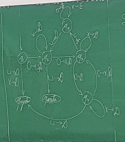

## Professor Gabriel

e-mail: fernandes@icmc.usp.br
sala 4-238

### Referências do Curso
Apostilas da Obmep
4) Indução Matemática
7) Criptografia

## Aula 1 - 12/03/2025

### Números Naturais

Podemos descrever os números naturais de acordo com a seguinte lista de axiomas:

**Axioma 1:** O $0$ é um número natural

**Axioma 2:** Se $n$ é um número natural, então existe um sucessor $n$, que denotamos por $n + 1$ , e $n+1$ é um número natural.

**Axioma 3:** Se $X_0$ é um conjunto de números naturais tal que $0 \in X_0$ e se $n \in X_0$, então $n+1 \in X_0$, então $X_0$ é o conjunto de todos os números naturais.

### Provas por Indução

#### Prova 1
A soma dos n primeiros números naturais:

\[S_n = 0 + 1 + 2+ 3+...+(n-1)\]

Vamos inverter a ordem de escrita dos termos de $S_n$, e realizarmos sua soma:

\[S_n = (n-1) + (n-2)+(n-3)+...+0\]

Realizando a soma de cada termo, percebemos que ele sempre dá $n-1$, logo, podemos escrever:

\[2S_n= (n-1)n\]
\[S_n=\frac{(n-1)n}{2}\]

Vamos agora provar a mesma formula utilizando indução:

Mostre que: 

\[X_0=\{0\} \cup \{n \in N | S_n=\frac{(n-1)n}{2}\}\] é tal que $X_0 = N $

Para mostrarmos que $X_0 = N$, temos que verificar que:

- $0 \in X_0$;
- Se $n \in X_0$, então $n +1 \in X_0$;

#### Nota do Professor
{$S_n$ não é mais a soma dos n-primeiros naturais, ou seja, $0+...+(n-1)$, de agora em diante $S_n$ é a soma dos $(n+1)$ primeiros naturais, ou seja, $0+...+(n-1)+n = S_n$}

Com essa mudança, teremos que a definição modificará a fórmula ligeiramente para a versão positiva.

#### Nota do Aluno

Meu deus do céu, é definição. Carrega ela até o fim, senhor! É pedir demais??? AHHHHHHHHHHH. Retornando à programação normal.

Vamos testar a fórmula positiva para 0:

\[S_0=0\]... OK!

\[S_1= 0+1 =1= \frac{(1+1)1}{2}\] ... OK!

\[S_2= 0+1+2 =3= \frac{(2+1)2}{2}\] ... OK!

Supondo que $n \in X_0$, ou seja, $S_n = \dfrac{(n+1)n}{2}$, queremos mostrar que $S_{n+1}=\dfrac{(n+1)(n+2)}{2}$.

Para isso, observe que $S_{n+1}=S_n+ (n+1)$, pois $0+1+...+n+(n+1)=S_{n+1}$. Logo:

\[\frac{(n+1)n}{2}+(n+1) = S_{n+1}\]

\[(n+1)(\frac{n}{2}+1) = S_{n+1}\]

\[\dfrac{(n+1)(n+2)}{2}=S_{n+1}\]

Assim, teremos que $(n+1) \in X_0 $ e $X_0 = \mathbb{N}$

#### Prova 2

Seja $A_n = 0^2+1^2+2^2+...+n^2$

\[A_0=0^2=0\] ... ok
\[A_1=0^2+1^2=1\] ...ok
\[A_2=0^2+1^2+2^2=5\] ...ok

Vamos mostrar que $X_0=\{n \in \mathbb{N}|A_n=\frac{n(n+1)(2n+1)}{6}\}$ é tal que $X_0 = \mathbb{N}$

Vamos mostrar que:

- $0 \in X_0$;
- Se $n \in X_0$, então $(n+1) \in X_0$. 

Para $n=0$, $A_0=0= \dfrac{0(0+1)(2 \cdot 0+1)}{6}$. Logo $0 \in X_0$.

Suponha que $n \in X_0$, ou seja, $A_n=\dfrac{n(n+1)(2n+1)}{6}$.

Queremos verificar que $A_{n+1}=0^2+1^2+2^2+...+n^2+(n+1)^2=\dfrac{(n+1)((n+1)+1)(2(n+1)+1)}{6}$

*Obs:* $A_n + (n+1)^2=A_{n+1}$

Assim:

\[A_{n+1}=\frac{n(n+1)(2n+1)}{6} + (n+1)^2\]

\[A_{n+1}=\frac{n(n+1)(2n+1)}{6} + \frac{6(n+1)^2}{6}\]

\[A_{n+1}=\frac{n(n+1)(2n+1)}{6} + \frac{6(n+1)^2}{6}\]

\[\frac{(n+1)(n(2n+1)+6(n+1))}{6}\]

\[\frac{(n+1)(2n^2+7n+6)}{6}\]

Temos $\dfrac{(n+1)((n+1)+1)(2(n+1)+1)}{6}$, desenvolvendo, obtemos o mesmo resultado. Logo ambos são a mesma fórmula, como queríamos demonstrar!

## Aula "2" - 26/03/2025

### Exemplos de Recursão

**Exemplo 1:**
\[
(n+1)! = (n+1)n!
\]

**Exemplo 2: Sequência de Fibonacci**

Sua recursão é bem simples, que consiste em, após definirmos $n_0=0$ e $n_1=1$, realizamos sua soma recursivamente. Curioso que a base da programação dinâmica são recursões desse estilo.

**Exemplo 3:** Sejam n, m $\in \mathbb{N}$ temos n + (m+1)= (n+m)+1

Assim, podemos encontrar o termo geral da sequência de fibonacci utilizando a recursão diretamente:

Suponha que $q \in mathbb{R}$ é tal que se $x_{n+1} = x_n + x_{n-1}$ 
> arrumar
>

Assim, $q^{n+1} = q^n + q^{n-1}$

> Resolva para n = 1

Observe que se $\alpha,\beta \in \mathbb{R}$ e $v_n=\alpha q^{n}_{1}$ e $w_n=\beta q^{n}_{2}$, então:

página 42 da apostila mais fotos Mateus. Basicamente é aula do poli sobre o trecho de recursões.

### Congruência Modular

Def: Dados dois inteiros m e n, dizemos que *m divide n* se existe $q \in \mathbb{Z}$ tal que $n=mq$.

Def: Dado $m,n \in \mathbb{Z}$ o resíduo de n módulo m é o inteiro positivo $r$ tal que $0 \leq r < m$ e $n = mq +r$ para algum $q \in \mathbb{Z}$.

Def: Dado $a,b, m \in \mathbb{Z}$ dizemos que $a$ é congruente a $b$ módulo $m$ se e somente se $m$ divide $b-a$. Ou seja:

\[
a \equiv b \pmod{m}    
\]

Um exemplo:

\[
4 \equiv 1 \pmod{3}
\]
pois 3 divide 4-1.

\[7 \equiv 1 \pmod{3}\] pois 7-1 é divisível por 3.

\[1 \equiv 10 \pmod{3}\] pois 1-10 é divisível por 3.

Todos os números da forma $3k+1,3k+2, 3k$, para algum $k \in \mathbb{Z}$

#### Um Teorema
Afirmação: Se $a \equiv b \pmod{n}$ então existem $q,q', r \in \mathbb{Z}$ tais que 

\[
a=nq+r\\
b=nq'+r\\
e\\
0 \leq r < n
\]

Prova: escreva $a = nq + r_0, b = nq'+r_1$. Por hipótese $b-a$ é divisivel por n. Logo existe um $q'' \in \mathbb{Z}$ tal que $b-a=q''n$.

\[
b-a=nq'+r_1 - nq - r_0\\
q''n=n(q'-q)+ r_1-r_0\\
-n(q'-q)+q''n = r_1-r_0
\]

Note que 

\[
0 \leq r_0<n \\
0 \leq r_1 <n
\]

Vamos supor que $r_1 \geq r_0$.

Então $0 \leq r_0 \leq r_1 < n$. Logo $0 \leq r_1 -r_0 < n$.

Por outro lado, $r_1-r_0=nk$ para algum $k \in \mathbb{Z}$. Porém se $k \neq 0$, então $nk \geq n$ ou $nk < 0$.

Portanto, $r_1-r_0=n \cdot 0=0$

## Aula 3 - 02/04/2025

Exercício: Calcule os inversos de 2, 3 e 6  módulo 6k+1. Escrever resposta em função de k.

entrega: 16/04 pelo e-disciplinas.

Prosseguindo...

**Lema:** Seja $\mathbb{X_0} \subseteq \mathbb{N}$ tal que $\mathbb{X_0} \neq \emptyset $. Então existe $d= min \mathbb{X_0}$.
 Vamos provar o exposto por absurdo. Seja $Y = \mathbb{N/X_0} = \{k \in \mathbb{N} | k \notin \mathbb{X_0} \}$ e suponha que não existe $min \mathbb{X_0}$. Vamos mostrar que $Y=\mathbb{N}$ contradizendo a hipótese que $\mathbb{X_0} \subseteq \emptyset $.

Vamos mostrar que $ 0 \in Y$ e se $n \in Y$, logo $n+1 \in Y$.

PROVA: Note que se $0 \in \mathbb{X_0}$, então $0 = min \mathbb{X_0}$.

Como supomos que não existe $ min \mathbb{X_0}$, então $0 \notin \mathbb{X_0}$. Logo $ 0 \in Y = \mathbb{X_0} \subseteq \mathbb{N}$

Se $n+1 \in \mathbb{X_0}$, teríamos $n+1=min \mathbb{X_0}$, uma contradição. Logo $n+1 \notin \mathbb{X_0}$. Portanto $n+1 \in Y$.

Portanto, $\mathbb{W} = \mathbb{N}$ e $\mathbb{Y} = \mathbb{N} = \mathbb{N/X_0}$. Isso contradiz a hipótese que $\mathbb{X_0} \subseteq \emptyset$.

### Inverso Multiplicativo

Pergunta: Dados $a,n \in \mathbb{Z}$ quando existe $a' \in \mathbb{Z}$ tal que $$a\cdot a' = \pmod{n}$$.

Lembre-se que:

\[x \equiv y \pmod{n} \iff n \text{ divide } x-y\]

**Notação: Escrevemos $b|a$ quando b divide a.**

Logo \[a \cdot a' \equiv 1\pmod{n} \\\iff\\ n| (a \cdot a' - 1) \\\iff\\ \text{existe } k \in \mathbb{Z} \text{ tal que } nk = aa' - 1\\\iff\\ \text{existe } k \in \mathbb{Z} \text{ tal que } 1 = a \cdot a' + n \cdot (-k)\]

Pergunta: Dados $a,n \in \mathbb{Z}$ quando existem $x_0,y_0 \in \mathbb{Z}$ tais que $$1 = ax_0 + ny_0$$?

Note que se

\[1=ax_0 + ny_0\], então $1=ax_0 + n (-(-y_0))$, sendo $-y_0 = k$.

Afirmaçao: Suponha que se $m \geq 1, m|a \text{ e } m|n, \text{ então } m=1$. Então existem $x_0, y_0 \in \mathbb{Z}$ tais que $1 = ax_0 + ny_0$.

Prova: Seja \[\mathbb{W} = \{z \in \mathbb{Z} | \ > 0 \wedge \text{ existem } x_0,y_0 \in \mathbb{Z} \text{ tais que } z = ax_0 +ny_0\}
    \]

Note que $n= a \cdot 0 + 1 \cdot n, -n = a \cdot 0 - 1 \cdot n$.

Portanto, se $n>0, \text{ então } n \in \mathbb{W}, \text{ caso contrário } -n \in \mathbb{W}. \text{ Assim, } \mathbb{W} \neq \emptyset$.

$\text{Seja } d = min \mathbb{W}. \text{ Vamos mostrar que } d |a \text{ e } d| n \text{ e portanto } d = 1 \text{ e existem } x_0, y_0 \in \mathbb{Z} \text{ tais que } 1 = d = ax_0 +ny_0$.

De $d \in \mathbb{W} \text{ existem } x0,y_0 \in \mathbb{Z} \text{ tais que } d=ax_0+ny_0$. Escreva $a = dq + r$, logo $a = (ax_0 + ny_0)q + r$.

Assim, $ r = a(1-x_0q) + n(-y_0q)$. Portanto, se $r>0, \text{ teríamos } r \in \mathbb{W}. \text{Porém } 0 \leq r < d = min \mathbb{W} $. Logo $r = 0$. Assim $a=dq$.

Escreva \[n=dq'+r'\]
Então \[n=(ax_0+ny_0)q' + r'\]
Portanto \[r' = a(-x_0q') + n(1-y_0q')\]

Se $r'>0, \text{ teríamos } r' \in \mathbb{W}. \text{ Porém, } 0 \leq r' < d = min \mathbb{W}. \text{ Logo } r'=0$ e $n=dq'$.

Dessa forma $d|a$ e $d|n \text{ portanto } d=1 \text{ e existem } x_0,y_0 \in  \mathbb{Z} \text{ tais que } 1= ax_0+ny_0$.

Afirmação: Sejam $p, n, a \in \mathbb{N}$. Suponha que $0<a<n$ e existem $b,c$ tais que $1<b<n, 1<c<n$, com $n=p\cdot b$ e $a = p \cdot c$. Então não existem $x_0, y_0 \in \mathbb{Z}$ tais que $ 1 = ax_0+ny_0$

Prova: Suponha que existem $x_0,y_0 \in \mathbb{Z}$ tais que isso seja verdade. Escreva $a=p \cdot c$. Multiplique a equação por $b$ então $b= bpc + bny_0$.

Com $n=bpx_0 = pb$. Temos $b=ncx_0 + nby_0= n(cx_0 +by_0)$. Isso contradiz $1<b<n$.

## aula 4 - 09/04/2025

### Algoritmo Chinês do Resto

Pergunta: $\text{Se} m \text{ e }  n \text{são primos entre si, } a, b \in \mathbb{Z} \text{ existe } x \in \mathbb{Z} \text{ tal que:}$

\[x \equiv a \pmod{m}\\
x \equiv b \pmod{n}\]

Vamos supor que \(x\) é solução destas equações. Então existe \(k \in \mathbb{Z}\) tal que

\[x = a + km\\
x-a = km\]

Portanto, teremos \(a+km \equiv \pmod{n}\).

Logo

\[km \equiv b -a \pmod{n}\]

Como \(m\) e \(n\) são primos entre si, existe \(m' \in \mathbb{Z}\) tal que \(m \cdot m' \equiv 1 \pmod{n}\), com \(m' \equiv m' \pmod{n}\). Assim, teremos que:

\[kmm' \equiv (b-a)m'\pmod{n}\\ \quad \\k \equiv (b-a)\pmod{n}\]

Logo, existe \( t \in \mathbb{Z}\) tal que:

\[k = (b-a)m'+tn\\ \quad \\ k-(b-a)m' = tn\]

Como \( x = a + km\) temos \(x = a + m((b-a)m' + tn)\). Portanto, sabendo que \( x - a = m((b-a)m' +tn)\), ou seja, que \(x - a\) é múltiplo de \(m\), teremos \(x \equiv a \pmod{m}\):

$$
x = a + m((b-a)m'+tn)
$$

### O Pequeno Teorema de Fermat

Teorema: Seja \(p\) um primo e \(a \in \mathbb{Z}\) tal que \(p \nmid a\) então:

\[ad^{p-2} \equiv a^{p-1} \equiv 1 \pmod{p}\]

Obs: \(p\) é primo e \(p \nmid a \iff \text{ p é primo e p e a são primos entre si} \iff \text{p é primo e o maior divisor comum de p e a é 1}\)

Prova: Listamos os resíduos módulo \(p\): \(1,2,3,..., p-1\). Multiplicando cada resíduo por \(a\), obtemos \(a,2a,3a,...,a(p-1)\).

Suponha que \(r_1\) seja o resíduo de \(a-1\) módulo \(p\) e \(r_2\) seja o resíduo de \(2a\) módulo \(p\). Vamos calcular \(r_1 r_2 r_3 ... r_{p-1}\). Temos

\[\begin{aligned}
    r_1 &\equiv a \pmod{p}\\
r_2 &\equiv 2a \pmod{p}\\
...\\
r_{p-1} &\equiv a(p-1)\pmod{p}
\end{aligned}
\]

---

Assim, teremos que:

\[
\begin{aligned}
r_1 r_2 r_3... r_{p-1} &\equiv (a-1)(a-2)(a-3)...(a-(p-1))\pmod{p}\\
&\equiv a^{p-1} \cdot (1\cdot 2 \cdot 3 ... \cdot (p-1))\pmod{p}
\end{aligned}
\]

Lembre-se \(1 \leq r_i \leq p-1\). Vamos agora mostrar que \(r_l - r_k \implies l = k\).

Se \(r_k = r_l\) então \(a'k \equiv al \pmod{p}\)

Como \(a\) e \(p\) sao primos entre si, existe \(a'\) tal que:

\[a' \cdot ak \equiv 1k \equiv a'al \equiv 1l \pmod{p}\]

Como \( 1 \leq k,l \leq p-1\) segue que \(k=l\), pois \(kl=sp\) para algum \(s \in \mathbb{Z}\).

Supondo \(1 \leq k \leq l\leq p-1\), temos \(0 \leq l-k \leq p-1\). Como \(l-k = -sp\), devemos ter \(s = 0\). Portanto \(l -k = 0\) e \(l=k\).

Obs: Note que se \(l \in \mathbb{Z}\) e \(l|p\) é \(l|(1 \cdot 2\cdot 3...(p-1))\), então \(l=1\) ou \(l=-1\). Assim existe \(z \in \mathbb{Z}\) tal que \(z(1 \cdot 2...\cdot (p-1)) \equiv 1 \pmod{p}\).

Portanto \(1 \equiv a^{p-1} \pmod{p}\).

Exemplo: \(p=5, a =7\)

\[
\begin{aligned}
7 \cdot 1 &\equiv 2 \pmod{5}, 2 = r_1\\
7 \cdot 2 &\equiv 4 \pmod{5}, 4 = r_2\\
7 \cdot 3 &\equiv 1 \pmod{5}, 1 = r_3\\
7 \cdot 4 &\equiv 3 \pmod{5}, 3 = r_4
\end{aligned}
\]

## Aula 5 - 09/04/2025

### Vamos conversar sobre o teorema de Fermat

Se \(p\) é primo e \(a \in \mathbb{Z}\) que não divide \(p\), então:

\[a^{p-1} \equiv 1 \pmod{p}\]

Lembre-se que se:

\[ a \equiv b \pmod{n} \\\iff \\\text{existe } k \in \mathbb{Z} \text{ tal que } a-b = kn \\\iff\\
\begin{aligned}
a &= jn +r, \text{ com } j, i \in \mathbb{Z}, 0 \leq r < n\\
b &= in +r\\
\end{aligned}
\]

#### Exercícios:

1. Calcule o resto da divisão de \(10^6\) por 7.

Vamos resolver!

\[
10^6 \equiv r \pmod{7}
\]

Aplicando o Teorema de Fermat para \(p=7\) e \(a=10\). Temos que \(a^{7-1} \equiv 1 \pmod{7}\), ou seja, \(10^6 \equiv 1 \pmod{7}\)

obs: \(a = jn+r \implies a-r = jn, a \equiv r \pmod{n}\)

2. Calcule o resto da divisão de \(10^135\) por 7.

Vamos Resolver!

Primeiro, vamos ver como forçar o resultado anterior aqui:

\(135 = 6 \cdot 22 + 3\), logo \(10^135 = 10^{6 \cdot 22 + 3} = 10^{6 \cdot 22} \cdot 10^3
= (10^6)^{22} \cdot 10^3 \)

Substituindo na congruência fornecida, teremos:

\[
\begin{aligned}
10^{135} &\equiv (10^6)^{22} \cdot 10^3 \pmod{7}\\
10^{135} &\equiv 1^{22} \cdot 10^3 \pmod{7}\\
10^{135} &\equiv 10^3 \pmod{7}\\
&\equiv 6 \pmod{7}
\end{aligned}
\]

3. Calcule o resto de \(10^{65} \pmod{7}\) e de \(3^{78} \pmod{7}\).

Queremos \(0 \leq r < 7 \) tal que:

\[
\begin{aligned}
10^{65} \equiv r \pmod{7}
\end{aligned}
\]

\(65 = 6 \cdot 10 + 5\), logo \(10^{65} = (10^6)^{10} \cdot 10^5\)

Substituindo no módulo, teremos:

\[
\begin{aligned}
10^{65} &\equiv (10^6)^{10}{10^5} \pmod{7}\\
&\equiv 1^{10} \cdot 10^5 \pmod{7}\\
&\equiv 10^3 \cdot 10^2 \pmod{7}\\
&\equiv 6 \cdot 10^2 \pmod{7}\\
&\equiv 600 \pmod{7}
\end{aligned}
\]

Veja que \(600 = 7 \cdot 85 + 5\), logo \(600 \equiv 5 \pmod{7}\)

> Inserir aqui a solução do 3^78
>
>

4. Qual o resto da divisão de \(2^{6556423} \pmod{31}\).

5. Qual o resto de \(2^{11^{38765}} \pmod{31}\).

6. Calcule o resto de \(2^{13^{98765}} \pmod{31}\).

## Aula 5 - 30/04/2025 - Criptografia RSA

> Colocar a tabela de números correspondentes ao alfabeto

## Aula 8 - Máquinas de Turing

Vamos descrever uma máquina M tal que M reconhece sequências de símbolos da forma \(a_1 a_2 a_3 ... a_n B a_1 a_2 .... a_n\). Suponha que tenhamos uma fita com a expressão \(abbaaaBabbaaaBBBB\)(o B é considerado como espaço em branco).

### Definição:

Uma máquina de Turing é uma 7-upla \([Q, \sum, \Gamma, \delta, q_0, q_{aceita}, q_{rejeita} ]\)

1. Q é um conjunto de estados;
2. \(\sum\) é o alfabeto inicial, com o espaço vazio \(B \nsubseteq \sum\);
3. \Gamma é um alfabeto com espaço vazio \(B \in \Gamma , \sum \subseteq \Gamma\);
4. \(S: Q \times \Gamma \to Q \times \Gamma \times {DE} \);
5. \(q_0 \in Q\) é o estado inicial;
6. \(q_{aceita}\) é o estado que aceita a palavra inicial;
7. \(q_{rejeita}\) é o estado que rejeita a palavra inicial;
   

Considere as palavras da forma 0000000..., ou seja \(2^n\) zeros para algum \(n \in \mathbb{N}\).

Seja:

Exercício:

Escreva a sequência de configurações nas quais essa máquina entra quando iniciada com 10#11;

### Teorema de Ramsey

Dado um grupo com 6 pessoas, existem 3 delas que não se conhecem entre si ou existem 3 delas que todas se conhecem.